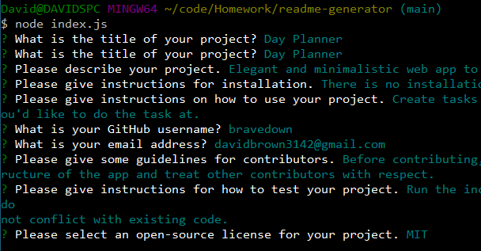
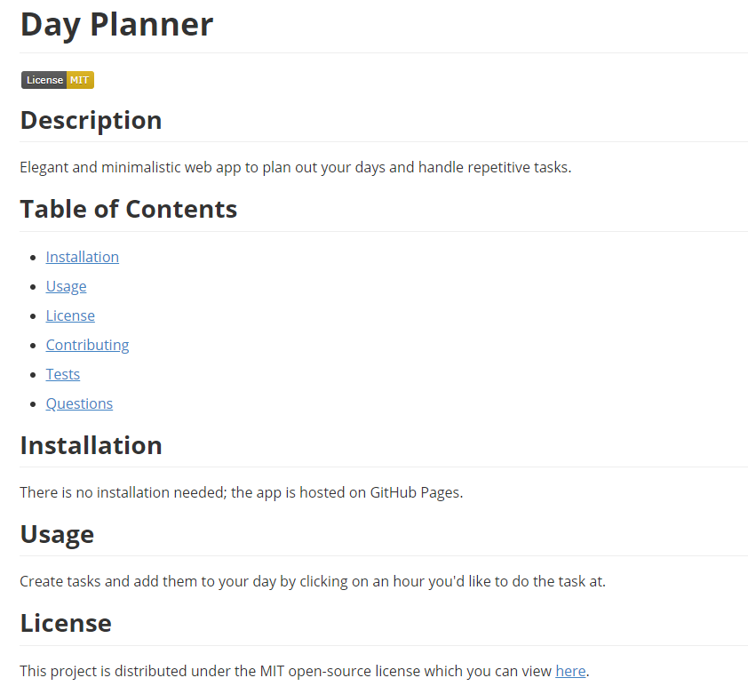

# README Generator
This is a Node.js app to dynamically generate a professional README file for your projects. 

## Table of Contents
- [Technologies](#technologies)
- [Demo](#demo)

## Technologies
Technologies used are JavaScript and Node.js.

## Demo
You can view a video demo of the app [here](https://drive.google.com/file/d/1FlX_0NaGY8yFTcjxLq-iJDBnr2Te4s2W/view?usp=sharing).

